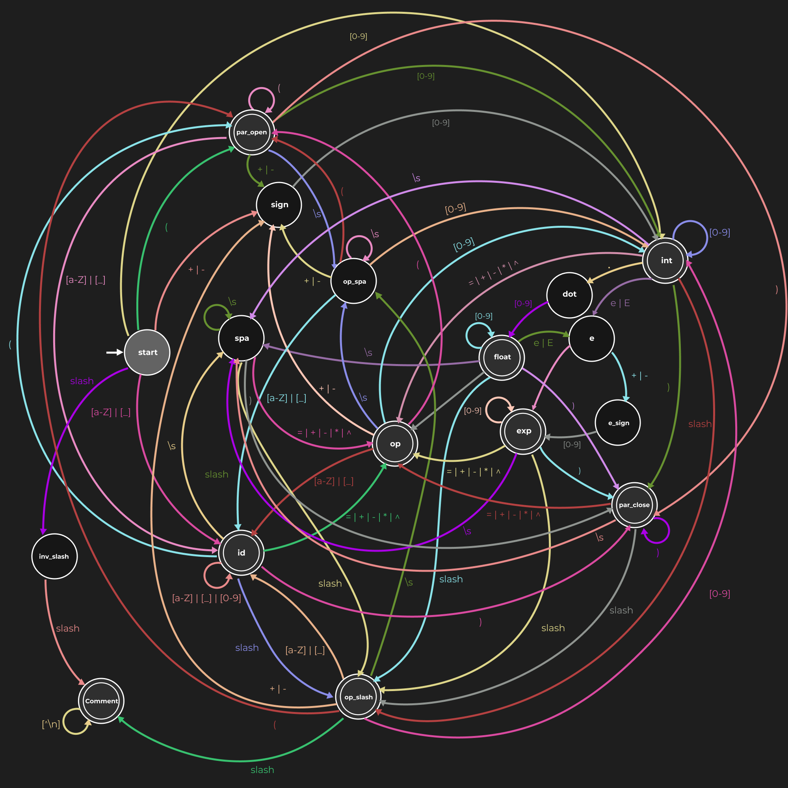

[](https://opensource.org/licenses/MIT)

# Lexer

## Author

* Joaquín Badillo

## Contents

A lexer is a special program that can be used to identify tokens (valid strings) according to a set of rules and tt is consequently a very important piece of software when creating a compiler or a syntax highlighter.

In this repository you will find a lexer programmed in Racket, that identifies tokens for arithmetic expressions using a deterministic finite automata (DFA) and principles of functional programming (given the fact that Racket is a programming language from the LISP family).

The lexer is defined as a function on the `main.rkt` file. The function is called `arithmetic-lexer` and it has arity 1. It takes a string of characters as an argument and returns a list of pairs that contain the names of the tokens identified and their values if the string is valid, otherwise, if the string is invalid (according to a transition function) it will return false (`#f`).

Since this program uses a DFA, the transition function specifies to which state to move depending on the character being analyzed and the current state we are in. The transition function is implemented in code using **a lot** of conditionals, but the DFA (and the transition function) can be visualized with a graph. The following image shows the graph representation of the DFA being used to analyze arithmetic expressions that are commonly found in programming.



If it is hard to visualize all the details of the image ti might be easier to inspect it in [Figma](https://www.figma.com/file/GKCXlOTaGbNCBzc3LyXnk5/DFA?node-id=0%3A1&t=qqBxfHreNRwA1X3L-1), where it was edited.

## Requirements

To use this project you only need to install Racket. This can be done using a package manager, for instance in Ubuntu 20.04 (I don't know if it will work on other Debian based distributions too)) it can be done with 2 simple commands inside a terminal
```
$ sudo apt-get update
```
```
$ sudo apt-get isntall racket -y
```

You might be able to use a package manager like choco or brew for Windows and MacOS operative systems, but it is also posible to use the installer provided by the racket website: [download racket](https://download.racket-lang.org/).

## Loading the function and using the lexer

To use the lexer you should open a terminal and move to this directory
```
$ cd path/to/this/directory
```

Once you are located inside this directory in your terminal, you can start racket in interactive mode and load the `main.rkt` file using the command
```
$ racket -it "main.rkt"
```
Where the `-i` flag specifies that we want to use racket interactively (which means that we can exectue instructions in the terminal) and the `-t` flag indicates that we are loading a file (which we are providing afterwards).

Once racket is open in interactive mode you can call the function with any string you desire as follows:
```
Welcome to Racket ...
> (arithmetic-lexer "some_string")
```

If you want to execute tester files, you can also use the `load` procedure
```
> (load "test_file.rkt")
```